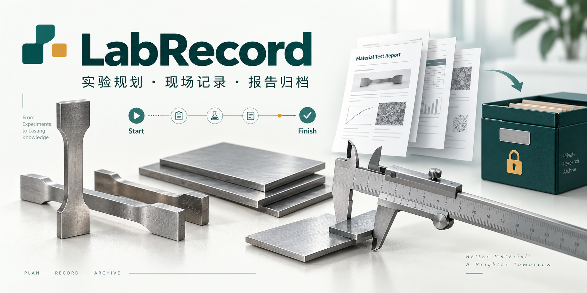
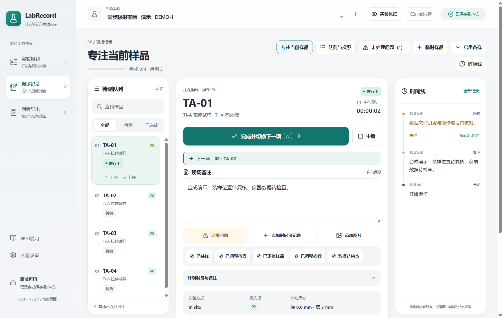
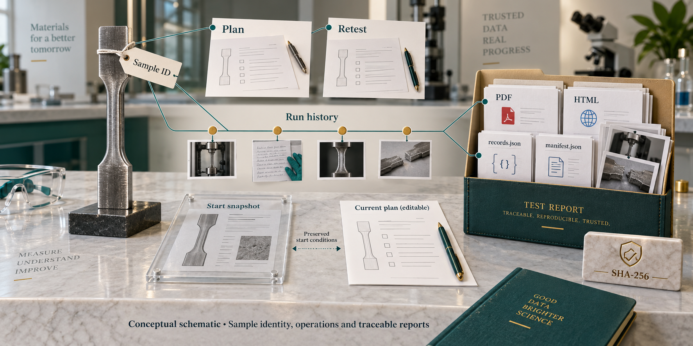
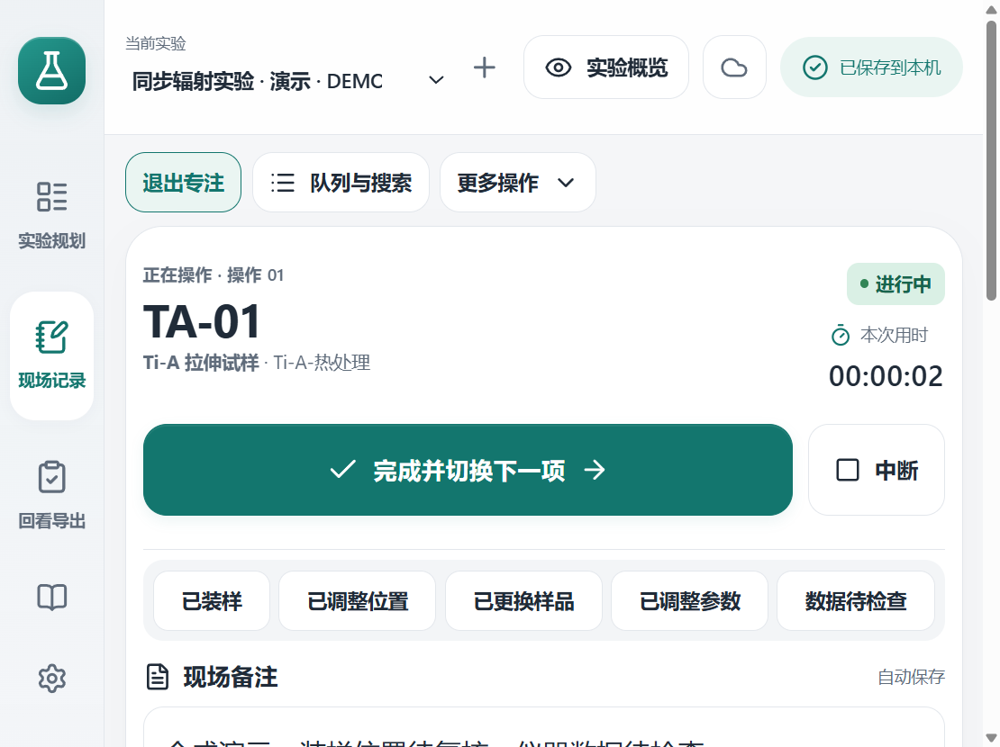
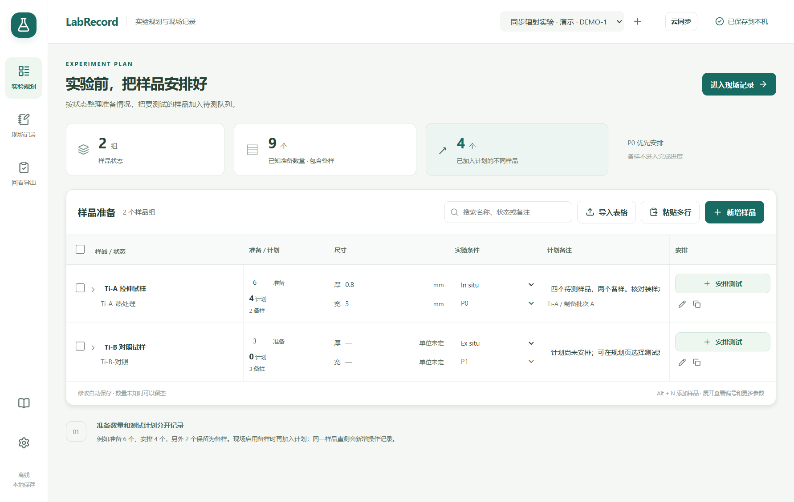
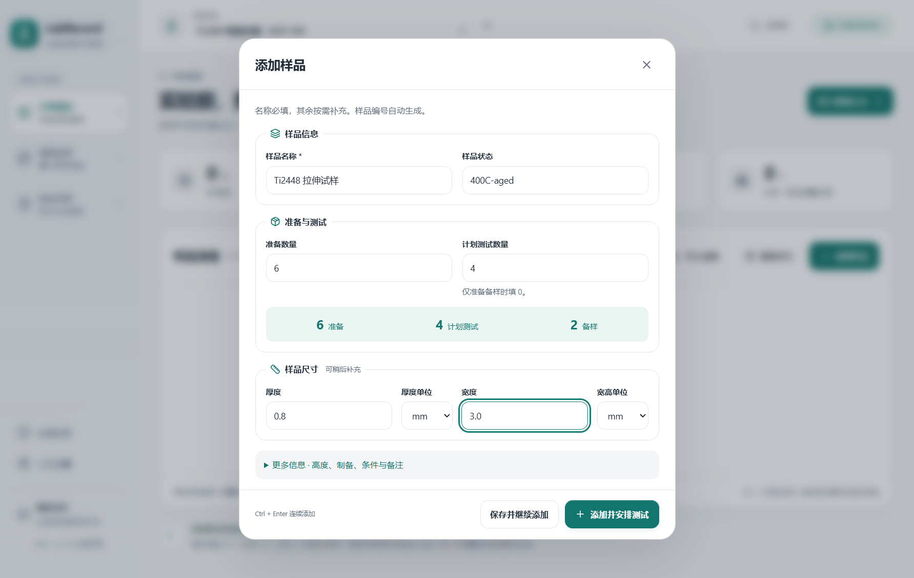
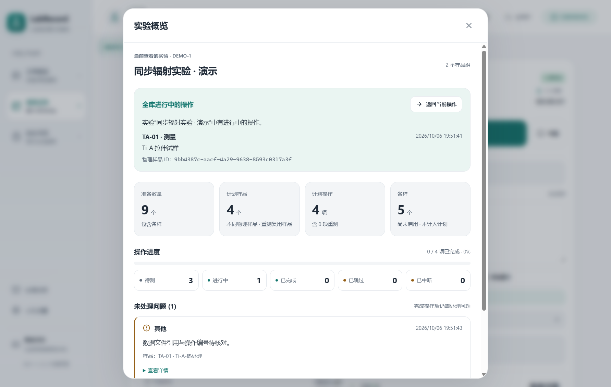
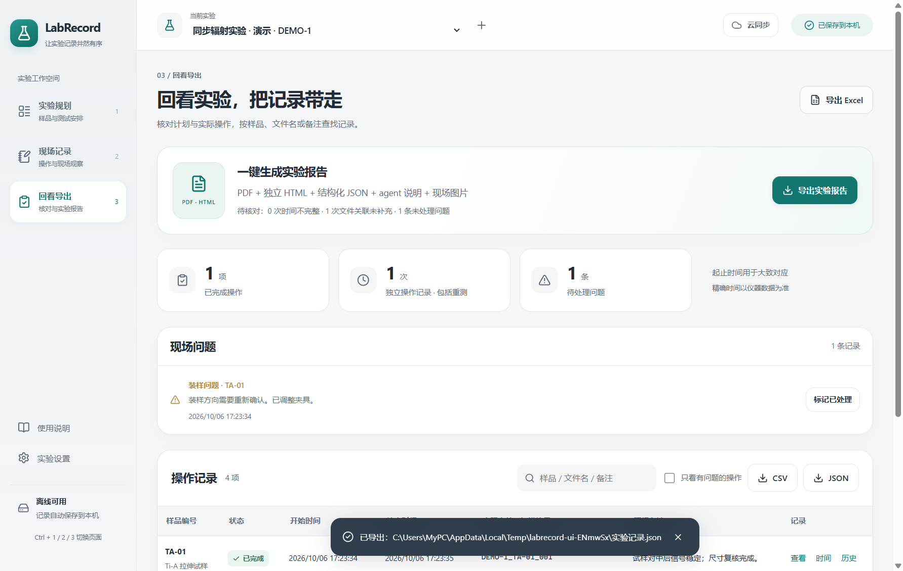
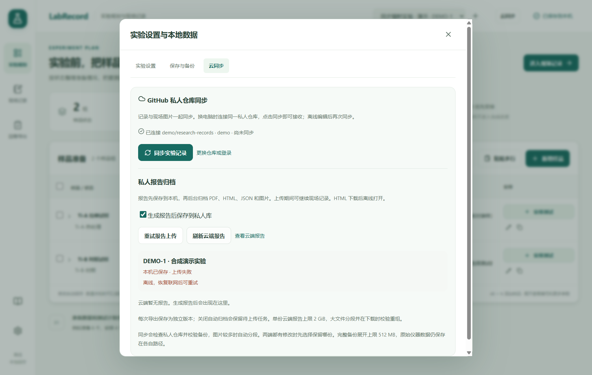

# LabRecord

**规划材料样品、记录现场操作，再导出可追溯的实验报告。**

中文 Windows 应用，实验规划、现场记录和报告可离线使用；换电脑时可连接自己的 GitHub 私人数据仓库。公开源码与私人实验记录分别保存。

[下载 Windows 版](https://github.com/D-sudoasd/LabRecord/releases/latest) · [三步完成一次实验](#三步完成一次实验) · [私人库设置](#把实验保存在自己的私人库) · [离线使用说明](docs/使用说明.html)

 [](LICENSE)



| 实验前 | 实验中 | 实验后 |
| --- | --- | --- |
| 添加样品、尺寸与计划操作 | 开始/完成、现场备注、问题与图片 | 导出 PDF、独立 HTML、完整 JSON 与校验清单 |

**下载版与截图版本：** 已发布 Windows 版为 `v0.4.0`；当前源码与下方截图为 `0.5.0`，包含专注记录、常用快记与实验概览。截图来自合成实验和独立临时数据；[截图来源](docs/images/sources.json)与[验证记录](docs/verification.md)保留适用范围。

_LabRecord is an offline-first Windows app for experiment planning, live sample records, and traceable reports. Experimental records and reports can be synchronized to your own private repository._

## 原理示意 / Principle schematic

<p align="center">
  
</p>

*概念示意：同一样品 ID 可关联原计划与重测，实际记录保存开始时快照及事件历史，报告目录同时交付可读文档、完整记录、图片与校验清单。不是实际实验记录或界面截图。*

*Conceptual schematic: a stable sample ID links planned and repeat operations; runs preserve start snapshots and event history, and reports include readable documents, complete records, images and checksums. This is not an actual experiment record or UI screenshot.*

[查看完整示意图 / View full-size schematic](assets/readme/principle.png)

## 现场记录，专注当前样品

队列、当前样品和时间线在同一页。点击“专注当前样品”切换为单列，将编号、主按钮和常用快记放在前面，滚动或输入时仍可看到编号与主按钮。“队列与搜索”可查找其他样品，“更多操作”可打开时间线、问题和临时安排，“退出专注”恢复完整布局。“正在操作”与“正在查看”分别显示当前操作和查看对象。下一项始终取完整排序中最靠前的待测操作；完成只选中它，需要再次点击开始。

“已装样”“已调整位置”等常用按钮创建带时间的记录，与自动保存的现场备注分开。“数据待检查”及问题模板表示后续检查事项，实验数据是否合格仍由仪器数据和实验条件判断。取消问题或时间线弹窗后，同一窗口内再次打开会保留类别、模板和文字；未提交草稿不写入数据库，也不在退出或崩溃后恢复。已提交记录保存失败时保留目标、内容与同一请求供重试，保存成功才清除。


900 × 700 窗口、150% 应用缩放时，专注首屏直接显示当前编号、主要按钮、常用快记、保存状态和概览入口。[正在输入时的界面](docs/images/focus-input.png)也保留当前目标与主按钮。



## 少填几次，多记录一点

填写名称即可添加样品并安排测试。信息、数量和尺寸分别填写，实时预览准备 / 测试 / 备样；数量不合适时直接提示。厚度与宽度直接录入，高度和其他参数按需展开；“保存并继续添加”保留参数，编号自动连续。





| 实验阶段 | LabRecord 提供什么                                                                   |
| -------- | ------------------------------------------------------------------------------------ |
| 实验前   | 名称与原始状态分开；连续编号、批量编辑、自定义字段与单位；Excel/CSV 导入和多行粘贴   |
| 实验中   | 逐项开始与完成；自动保存、时间修正、问题与图片；插入样品、启用备样、跳过、中断和重测 |
| 实验后   | 一次生成 PDF、独立 HTML、完整 JSON、图片、agent 阅读说明及 SHA-256 清单              |
| 换电脑   | 私人库同步完整记录与图片；报告独立归档，可列出并下载；失败保留本机文件与待上传任务   |

准备总数、不同待测样品数和计划操作数分别统计。例如，准备 6 个、安排 4 个样品时，保留 2 个备样；追加一次重测后仍为 4 个不同样品，共 5 次计划操作。重测保留原样品关联，备样启用后才进入计划。

## 随时查看实验进度与问题

在任意页面点击顶栏“实验概览”，查看当前实验的样品与操作统计。未知准备数量保留“未知”或未知组数，完成、待测、进行中、跳过和中断分别列出。概览同时显示全库进行中的操作；查看另一实验时可先保存输入，再“切换并返回”准确的操作。

未处理问题在完成后仍保留，可查看详情、定位已关联的样品并标记已处理；实验级未关联问题保留独立明细。概览内容单独滚动，关闭后回到原页面和位置。



## 三步完成一次实验

1. **下载并解压。** 从 [Releases](https://github.com/D-sudoasd/LabRecord/releases/latest) 下载 Windows x64 ZIP，解压整个文件夹，双击 `LabRecord.exe`。无需安装 Node、Python、Excel 或数据库。首次打开可载入演示实验。
2. **规划并记录。** 规划页添加样品；`Alt+N` 打开快速添加，`Ctrl+Enter` 保存并继续添加。`Ctrl+1 / 2 / 3` 切换规划、现场和回看页，切换前保存当前输入。现场点击开始、完成，或在非编辑区域按 `F8`；输入框、中文输入法组合输入、打开的弹窗和重复按键不会触发 F8 记录。重新打开软件，已保存但未结束的操作仍保留。
3. **生成报告。** 回看页点击“导出实验报告”并选择目录。报告先保存到本机；已连接私人库时，后台继续归档，可在“云同步”查看状态、重试或下载。

```text
report.pdf        阅读与分享
report.html       含图片的独立报告，下载后离线打开
records.json      完整实体、稳定 ID、单位、空值和修改历史
README-agent.md  后续 agent 的读取入口与数据含义
images/          现场图片原文件
manifest.json    文件大小与 SHA-256
```

将完整目录交给后续 agent，先读 `README-agent.md`，再核对 `records.json`。未知时间保持空白，计划参数与实际修改分别保存。



## 把实验保存在自己的私人库

公开仓库保存源码与演示素材。**每位使用者独立连接自己的私人数据仓库**；公开源码不会授予实验数据的访问权限。

1. 在 GitHub 创建并初始化一个私人仓库，例如 `你的账号/research-records`。点击软件顶栏“云同步”，填写仓库地址。
2. 使用本机已登录的 GitHub CLI，或填写只授予该私人库 **Contents 读写**权限的细粒度令牌。令牌由 Windows 加密保存在本机；每台电脑独立登录。
3. 点击“同步实验记录”。另一电脑连接同一私人库后同步，即可接续。记录同步手动触发，现场可以保持离线。
4. “生成报告后保存到私人库”默认开启。报告先本机保存，再后台上传；失败保留任务，启动、重新连接或点击同步时重试。云同步页提供状态、查看、刷新和下载入口。

```text
labrecord/
  latest.json                         最新完整实验备份索引
  snapshots/                          数据库、历史与图片的完整备份
  reports/
    README.md                         报告阅读索引
    index.json                        机器可读索引
    <experiment-id>/<report-id>/       每次导出的独立报告版本
```



多个电脑归档报告时保留各自版本。两端独立修改完整实验记录时，软件提示选择版本，接收前为本机制作备份。进行中的本机操作需要先完成或中断才能接收云端。

仪器原始数据保存路径引用，迁移时另行复制。现场图片包含在备份与报告中。单张图片上限 10 MB，完整备份及展开内容上限 512 MiB，单份云端报告上限 2 GiB；大文件分段上传，下载时校验重组。

## 开发、验证与贡献

Electron、React、TypeScript、SQLite；交付 Windows x64。开发使用 Node.js 24，依赖版本固定在锁文件中。下载包内含运行环境。

```powershell
npm ci
npm run dev
npm run verify
npm run dist
npm run test:packaged
node scripts/check-release.mjs
```

常规测试使用独立临时数据，不访问 GitHub。显式联网验收：

```powershell
node scripts/test-live-cloud.mjs 你的账号/私人测试库
```

联网检查使用随机隔离目录与合成实验，结束后清理测试文件。提交问题时提供复现步骤和脱敏截图，实验记录、令牌和备份保存在私人存储。

[数据与实现说明](docs/architecture.md) · [验收记录](docs/verification.md) · [私人报告归档说明](docs/private-storage.md) · [MIT 许可证](LICENSE)

Windows 程序目前未进行代码签名。报告整理已保存记录，实际实验结论由仪器数据与实验条件判定。首页主视觉由 imagegen 生成；[主视觉生成提示词与来源](assets/readme/generation.md)。界面图来自真实 Electron 软件的合成实验，归档图使用模拟的私人库与离线失败状态，不代表本轮真实联网操作；[界面截图来源](docs/images/sources.json)。
